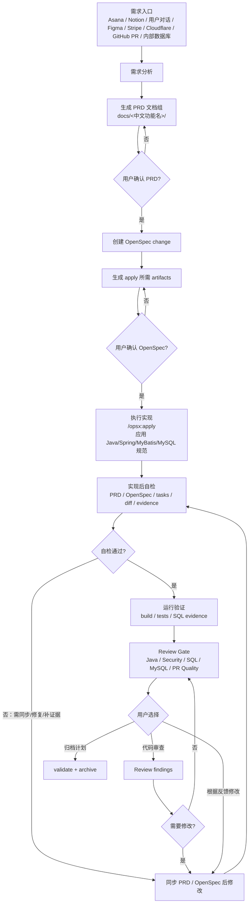
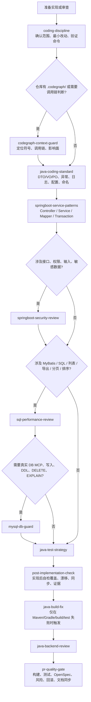
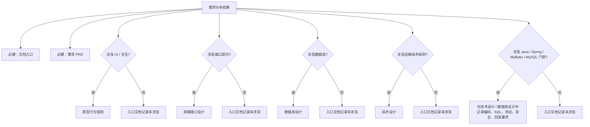
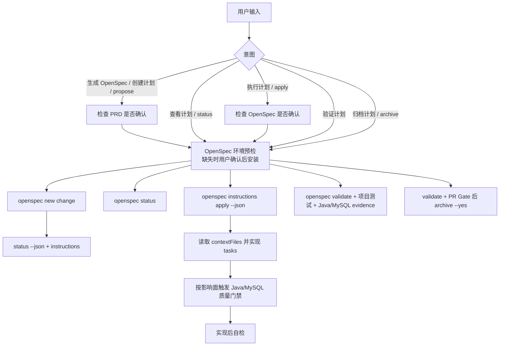
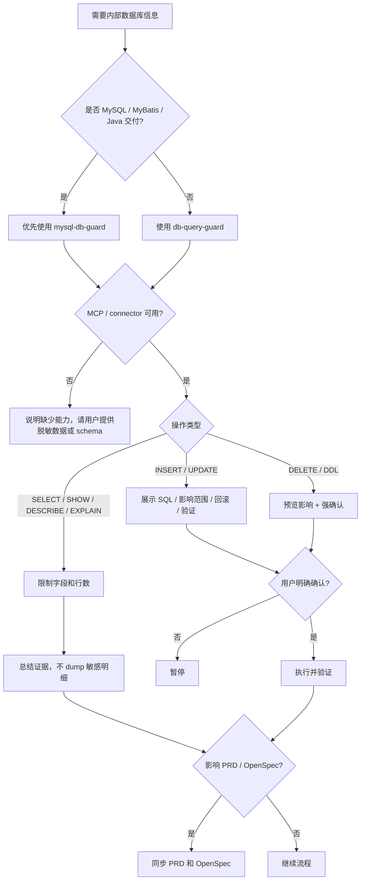
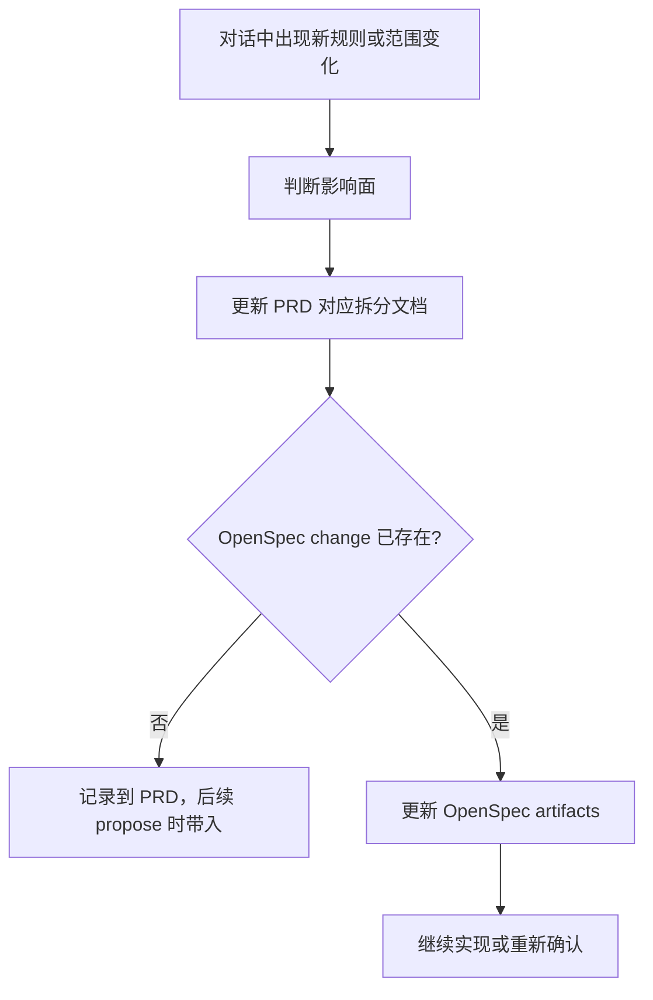

# 流程图

## 主流程

```mermaid
flowchart TD
  A["需求入口<br/>Asana / Notion / 用户对话 / Figma / Stripe / Cloudflare / GitHub PR / 内部数据库"] --> B["需求分析"]
  B --> C["生成 PRD 文档组<br/>docs/&lt;中文功能名&gt;/"]
  C --> D{"用户确认 PRD?"}
  D -- "否" --> C
  D -- "是" --> E["创建 OpenSpec change"]
  E --> F["生成 apply 所需 artifacts"]
  F --> G{"用户确认 OpenSpec?"}
  G -- "否" --> F
  G -- "是" --> H["执行实现<br/>/opsx:apply<br/>应用 Java/Spring/MyBatis/MySQL 规范"]
  H --> H1["实现后自检<br/>PRD / OpenSpec / tasks / diff / evidence"]
  H1 --> H2{"自检通过?"}
  H2 -- "否：需同步/修复/补证据" --> N["同步 PRD / OpenSpec 后修改"]
  H2 -- "是" --> I["运行验证<br/>build / tests / SQL evidence"]
  I --> J["Review Gate<br/>Java / Security / SQL / MySQL / PR Quality"]
  J --> K{"用户选择"}
  K -- "代码审查" --> L["Review findings"]
  L --> M{"需要修改?"}
  M -- "是" --> N
  N --> H1
  M -- "否" --> J
  K -- "根据反馈修改" --> N
  K -- "归档计划" --> O["validate + archive"]
```

## Java / MySQL 质量门禁

```mermaid
flowchart TD
  A["准备实现或审查"] --> B["coding-discipline<br/>确认范围、最小改动、验证命令"]
  B --> C{"仓库有 .codegraph/ 或需要调用链判断?"}
  C -- "是" --> C1["codegraph-context-guard<br/>定位符号、调用链、影响面"]
  C -- "否" --> D["java-coding-standard<br/>DTO/VO/PO、异常、日志、配置、命名"]
  C1 --> D
  D --> E["springboot-service-patterns<br/>Controller / Service / Mapper / Transaction"]
  E --> F{"涉及接口、权限、输入、敏感数据?"}
  F -- "是" --> F1["springboot-security-review"]
  F -- "否" --> G{"涉及 MyBatis / SQL / 列表 / 导出 / 分页 / 排序?"}
  F1 --> G
  G -- "是" --> G1["sql-performance-review"]
  G1 --> G2{"需要真实 DB MCP、写入、DDL、DELETE、EXPLAIN?"}
  G2 -- "是" --> G3["mysql-db-guard"]
  G2 -- "否" --> H["java-test-strategy"]
  G -- "否" --> H
  G3 --> H
  H --> I["post-implementation-check<br/>实现后自检覆盖、漂移、同步、证据"]
  I --> J["java-build-fix<br/>仅在 Maven/Gradle/build/test 失败时触发"]
  J --> K["java-backend-review"]
  K --> L["pr-quality-gate<br/>构建、测试、OpenSpec、风险、回滚、文档同步"]
```

## PRD 文档拆分

```mermaid
flowchart TD
  A["需求分析结果"] --> B["必建：文档入口"]
  A --> C["必建：需求 PRD"]
  A --> D{"涉及 UI / 交互?"}
  A --> E{"涉及接口契约?"}
  A --> F{"涉及数据库?"}
  A --> G{"涉及后端技术规则?"}
  A --> H{"涉及 Java / Spring / MyBatis / MySQL 门禁?"}
  D -- "是" --> D1["原型行为规则"]
  D -- "否" --> D2["入口文档记录未涉及"]
  E -- "是" --> E1["前端接口设计"]
  E -- "否" --> E2["入口文档记录未涉及"]
  F -- "是" --> F1["数据库设计"]
  F -- "否" --> F2["入口文档记录未涉及"]
  G -- "是" --> G1["技术设计"]
  G -- "否" --> G2["入口文档记录未涉及"]
  H -- "是" --> H1["在技术设计 / 数据库设计中记录编码、SQL、测试、安全、回滚要求"]
  H -- "否" --> H2["入口文档记录未涉及"]
```

## OpenSpec 指令路由

```mermaid
flowchart TD
  A["用户输入"] --> B{"意图"}
  B -- "生成 OpenSpec / 创建计划 / propose" --> C["检查 PRD 是否确认"]
  C --> P["OpenSpec 环境预检<br/>缺失时用户确认后安装"]
  P --> D["openspec new change"]
  D --> E["status --json + instructions"]
  B -- "查看计划 / status" --> P
  P --> F["openspec status"]
  B -- "执行计划 / apply" --> G["检查 OpenSpec 是否确认"]
  G --> P
  P --> H["openspec instructions apply --json"]
  H --> I["读取 contextFiles 并实现 tasks"]
  I --> I1["按影响面触发 Java/MySQL 质量门禁"]
  I1 --> I2["实现后自检"]
  B -- "验证计划" --> P
  P --> J["openspec validate + 项目测试 + Java/MySQL evidence"]
  B -- "归档计划 / archive" --> P
  P --> K["validate + PR Gate 后 archive --yes"]
```

## 数据库 MCP 安全流

```mermaid
flowchart TD
  A["需要内部数据库信息"] --> A1{"是否 MySQL / MyBatis / Java 交付?"}
  A1 -- "是" --> A2["优先使用 mysql-db-guard"]
  A1 -- "否" --> A3["使用 db-query-guard"]
  A2 --> B{"MCP / connector 可用?"}
  A3 --> B
  B -- "否" --> C["说明缺少能力，请用户提供脱敏数据或 schema"]
  B -- "是" --> D{"操作类型"}
  D -- "SELECT / SHOW / DESCRIBE / EXPLAIN" --> E["限制字段和行数"]
  E --> F["总结证据，不 dump 敏感明细"]
  D -- "INSERT / UPDATE" --> G["展示 SQL / 影响范围 / 回滚 / 验证"]
  G --> H{"用户明确确认?"}
  H -- "否" --> I["暂停"]
  H -- "是" --> J["执行并验证"]
  D -- "DELETE / DDL" --> K["预览影响 + 强确认"]
  K --> H
  F --> L{"影响 PRD / OpenSpec?"}
  J --> L
  L -- "是" --> M["同步 PRD 和 OpenSpec"]
  L -- "否" --> N["继续流程"]
```

## 同步规则

```mermaid
flowchart TD
  A["对话中出现新规则或范围变化"] --> B["判断影响面"]
  B --> C["更新 PRD 对应拆分文档"]
  C --> D{"OpenSpec change 已存在?"}
  D -- "否" --> E["记录到 PRD，后续 propose 时带入"]
  D -- "是" --> F["更新 OpenSpec artifacts"]
  F --> G["继续实现或重新确认"]
```
