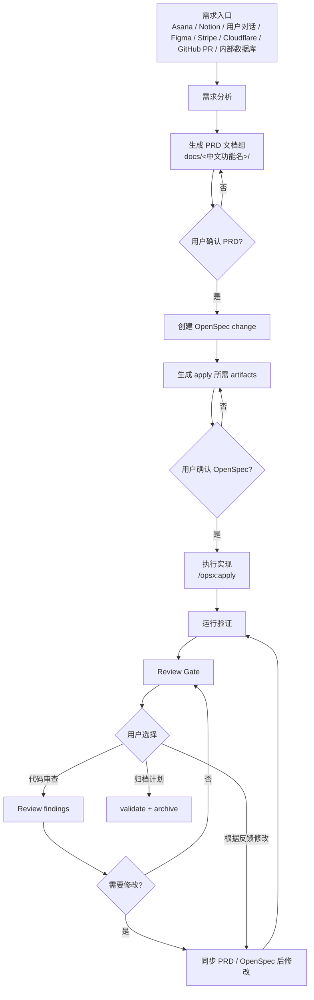
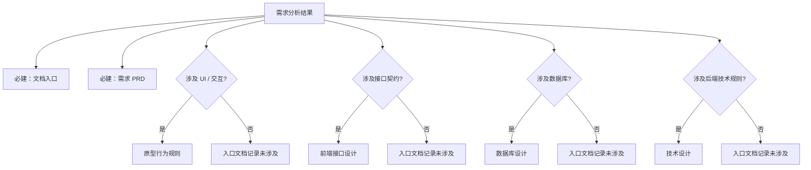
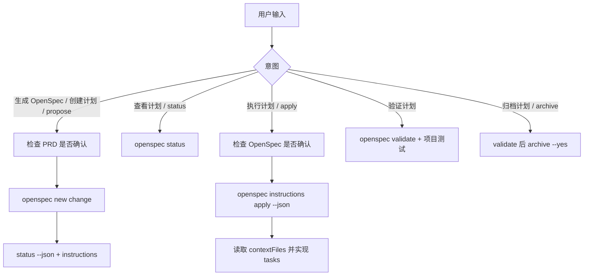
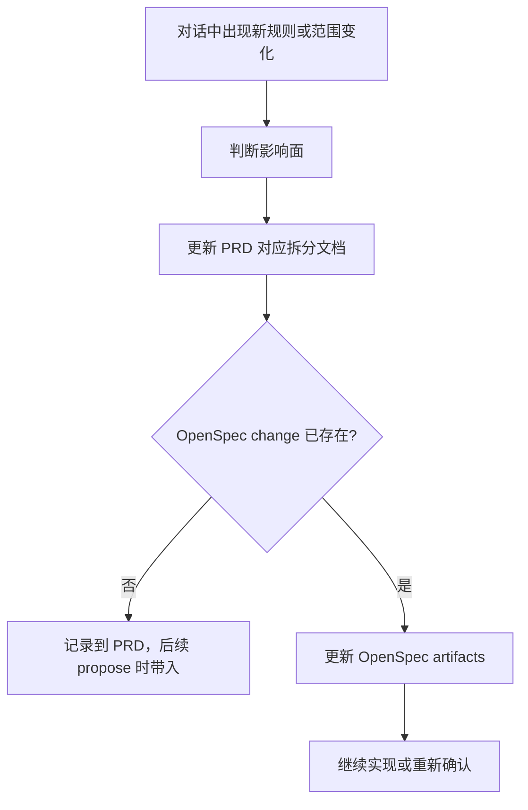

# 流程图

## 主流程

```mermaid
flowchart TD
  A["需求入口<br/>Asana / Notion / 用户对话 / Figma / Stripe / Cloudflare / GitHub PR / 内部数据库"] --> B["需求分析"]
  B --> C["生成 PRD 文档组<br/>docs/&lt;中文功能名&gt;/"]
  C --> D{"用户确认 PRD?"}
  D -- "否" --> C
  D -- "是" --> E["创建 OpenSpec change"]
  E --> F["生成 apply 所需 artifacts"]
  F --> G{"用户确认 OpenSpec?"}
  G -- "否" --> F
  G -- "是" --> H["执行实现<br/>/opsx:apply"]
  H --> I["运行验证"]
  I --> J["Review Gate"]
  J --> K{"用户选择"}
  K -- "代码审查" --> L["Review findings"]
  L --> M{"需要修改?"}
  M -- "是" --> N["同步 PRD / OpenSpec 后修改"]
  N --> I
  M -- "否" --> J
  K -- "根据反馈修改" --> N
  K -- "归档计划" --> O["validate + archive"]
```

## PRD 文档拆分

```mermaid
flowchart TD
  A["需求分析结果"] --> B["必建：文档入口"]
  A --> C["必建：需求 PRD"]
  A --> D{"涉及 UI / 交互?"}
  A --> E{"涉及接口契约?"}
  A --> F{"涉及数据库?"}
  A --> G{"涉及后端技术规则?"}
  D -- "是" --> D1["原型行为规则"]
  D -- "否" --> D2["入口文档记录未涉及"]
  E -- "是" --> E1["前端接口设计"]
  E -- "否" --> E2["入口文档记录未涉及"]
  F -- "是" --> F1["数据库设计"]
  F -- "否" --> F2["入口文档记录未涉及"]
  G -- "是" --> G1["技术设计"]
  G -- "否" --> G2["入口文档记录未涉及"]
```

## OpenSpec 指令路由

```mermaid
flowchart TD
  A["用户输入"] --> B{"意图"}
  B -- "生成 OpenSpec / 创建计划 / propose" --> C["检查 PRD 是否确认"]
  C --> D["openspec new change"]
  D --> E["status --json + instructions"]
  B -- "查看计划 / status" --> F["openspec status"]
  B -- "执行计划 / apply" --> G["检查 OpenSpec 是否确认"]
  G --> H["openspec instructions apply --json"]
  H --> I["读取 contextFiles 并实现 tasks"]
  B -- "验证计划" --> J["openspec validate + 项目测试"]
  B -- "归档计划 / archive" --> K["validate 后 archive --yes"]
```

## 同步规则

```mermaid
flowchart TD
  A["对话中出现新规则或范围变化"] --> B["判断影响面"]
  B --> C["更新 PRD 对应拆分文档"]
  C --> D{"OpenSpec change 已存在?"}
  D -- "否" --> E["记录到 PRD，后续 propose 时带入"]
  D -- "是" --> F["更新 OpenSpec artifacts"]
  F --> G["继续实现或重新确认"]
```
